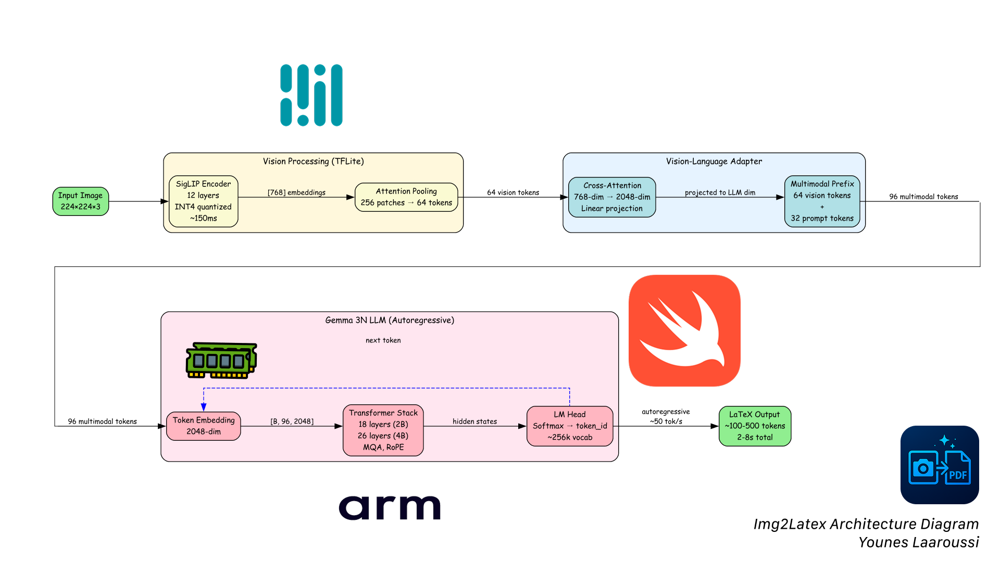
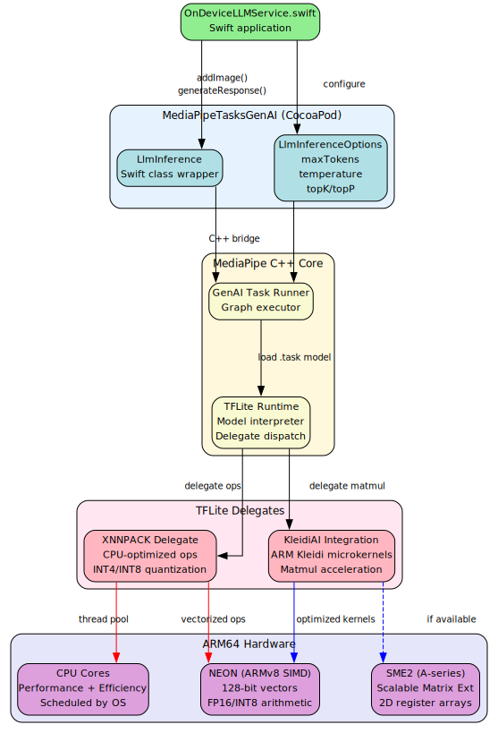
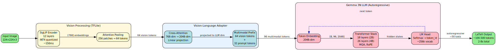
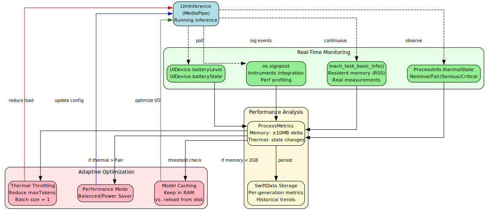
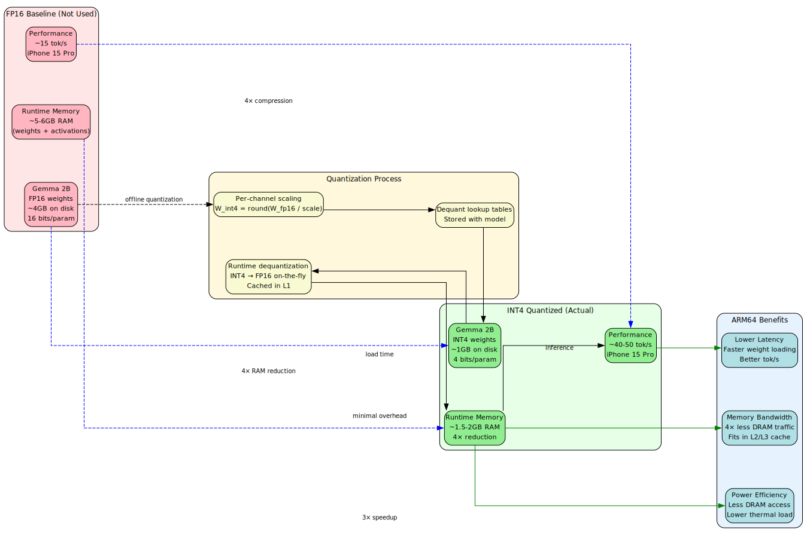

# Img2Latex Whitepaper

**Stream multimodal AI inference at 5–10 tokens/sec (on Arm SME2-enabled devices). Watch Gemma 3N vision models convert math to LaTeX in real-time. Zero cloud APIs. Pure ARM64.**

[](https://www.arm.com/)
[](https://developers.google.com/mediapipe)
[](https://www.arm.com/technologies/kleidi)
[](https://developer.arm.com/Architectures/Scalable%20Matrix%20Extension)
[]()
[]()




Img2Latex converts handwritten math, lecture notes, and problem sets into professional PDFs—**100% on-device** with **ARM-optimized AI**. Built for the Arm AI Developer Challenge 2025, this app demonstrates production-grade multimodal LLM deployment with real-time performance monitoring on iOS.

## Key Features

- **100% On-Device Processing**: Zero cloud dependencies, all AI inference runs locally using MediaPipe Tasks GenAI
- **Multimodal Vision AI**: Gemma 3N with vision encoder/adapter for image-to-LaTeX conversion
- **ARM64 Optimizations**: Accelerate framework (vImage) for image preprocessing, INT4 quantized models
- **ARM-optimized backends (via MediaPipe)**: MediaPipe integrates ARM kernels (KleidiAI/XNNPACK); SME2-compatible on supported devices
- **Client-Side PDF Rendering**: WKWebView + latex.js for zero-dependency PDF generation
- **Real-Time Metrics**: Live CPU, memory, battery, and thermal monitoring during AI inference
- **Model Management**: Download and switch between Gemma 3N 2B and 4B models at runtime
- **Persistent History**: SwiftData storage with search, favorites, and refinement tracking
- **LaTeX Refinement**: Iterative improvements with user feedback and history

---

## Technical Architecture

### Overview

Img2Latex demonstrates ARM-optimized on-device AI for multimodal document understanding:

**AI/ML Stack**:
- **Gemma 3N (2B/4B)** [[1]](#references): INT4 quantized vision-language models running entirely on ARM CPU
- **MediaPipe Tasks GenAI 0.10.24** [[2]](#references): Inference runtime with integrated ARM backends (KleidiAI/XNNPACK)
- **SME2 Compatibility**: Automatic use of Scalable Matrix Extension 2 on iPhone 16/M4; NEON fallback on older devices
- **Vision Pipeline**: Extracts TFLite vision encoder/adapter from `.task` files; processes up to 5 images per inference

**ARM64 Optimizations**:
- **Accelerate Framework** [[3]](#references): vImage SIMD operations for parallel image downscaling (ARM NEON)
- **INT4 Quantization**: 4-bit weights optimized for ARM integer pipelines 
- **Thermal Management**: ProcessInfo monitoring with adaptive performance tuning
- **Zero GPU Dependency**: Pure CPU inference leveraging ARM's efficient matrix operations via KleidiAI [[4]](#references)

**Architecture**: SwiftUI app with MediaPipe inference service, client-side PDF rendering (WKWebView + latex.js), and SwiftData persistence

### Core Technologies

| Component | Technology | Purpose |
|-----------|------------|---------|
| **AI Inference** | MediaPipe Tasks GenAI 0.10.24 [[2]](#references) | On-device LLM runtime (ARM-optimized via KleidiAI [[4]](#references)/XNNPACK; SME2-compatible on supported devices) |
| **Vision Processing** | Gemma 3N Vision Encoder/Adapter [[1]](#references) | Multimodal image understanding (extracted from .task files) |
| **ARM Optimization** | Accelerate Framework (vImage) [[3]](#references) | SIMD-accelerated image downscaling |
| **Model Format** | INT4 Quantized TFLite | 4-bit quantization for memory efficiency |
| **PDF Rendering** | WKWebView + latex.js [[5]](#references) | Client-side LaTeX compilation to PDF |
| **Data Persistence** | SwiftData | Type-safe local storage |
| **UI Framework** | SwiftUI + Charts | Declarative UI with real-time performance visualization |

---

## Gemma 3N Integration

### Selective Parameter Activation

Gemma 3N E2B and E4B models use selective parameter activation, achieving effective parameter counts of 2B and 4B while containing more total parameters. This technique reduces memory bandwidth and improves inference speed on mobile devices by activating only the necessary parameters for each token prediction.

### Multimodal Vision Support

The Gemma 3N models include vision encoder and adapter components for multimodal input:

1. **Vision Encoder**: TFLite model that processes images into embeddings (extracted from `.task` archive)
2. **Vision Adapter**: Bridges vision embeddings to the language model's input space
3. **Multi-Image Support**: Handles up to 5 images per generation for document conversion

Our implementation extracts these components from the `.task` file using ZIPFoundation and configures MediaPipe's `LlmInference` with vision modality enabled:

```swift
options.visionEncoderPath = extractedVisionEncoderPath.path
options.visionAdapterPath = extractedVisionAdapterPath.path
options.maxImages = 5
options.enableVisionModality = true
```

### INT4 Quantization Benefits

INT4 quantization reduces model size by 4x compared to FP16 while maintaining accuracy for generative tasks:
- **2B Model**: ~500MB (down from ~2GB FP16)
- **4B Model**: ~900MB (down from ~3.6GB FP16)
- **Efficiency**: Reduces memory bandwidth and improves throughput on ARM CPUs
- **Energy**: Lower power consumption, critical for mobile devices

---

## ARM64 Optimizations

Img2Latex leverages ARM64-specific features throughout the pipeline for maximum performance and energy efficiency. MediaPipe integrates ARM-optimized backends (KleidiAI [[4]](#references)/XNNPACK) and uses SME2 automatically on supported hardware; older devices fall back to NEON.




### 1. vImage Accelerated Downscaling

Images are downscaled in parallel using the Accelerate framework's vImage API, which uses ARM NEON SIMD instructions:

```swift
private func downscaleCGImageAccelerate(_ src: CGImage, maxDimension: Int) -> CGImage? {
    // ... format setup ...
    
    vImageScale_ARGB8888(&srcBuf, &dstBuf, nil, vImage_Flags(kvImageHighQualityResampling))
    
    return vImageCreateCGImageFromBuffer(&dstBuf, &format, nil, nil, vImage_Flags(kvImageNoAllocate), nil)?.takeRetainedValue()
}
```

**Benefits**:
- 30-70% size reduction before inference
- Parallel processing via Swift TaskGroup (up to 10 images simultaneously)
- SIMD-accelerated resampling (ARM NEON intrinsics)
- Lower memory footprint during vision encoding

*Note: Performance improvements enabled by KleidiAI integration through MediaPipe's XNNPACK backend [[4]](#references).*

### 2. INT4 Quantization Pipeline

Models are quantized to INT4 precision for deployment:
- Weights stored as 4-bit integers
- Dynamic dequantization during inference
- ARM64 optimized INT8/INT4 matrix multiplication kernels in MediaPipe

### 3. Performance Mode Tuning

Adaptive parameters based on thermal state and user preference:

| Parameter | Normal Mode | Performance Mode |
|-----------|-------------|------------------|
| Max Tokens | 2000 | 1200 |
| Image Size | 1536px | 1024px |
| Top K | 40 | 60 |
| Top P | 0.90 | 0.95 |
| Temperature | 0.7 | 0.6 |

### 4. Thermal Management

Real-time thermal monitoring with adaptive behavior:

```swift
NotificationCenter.default.addObserver(
    forName: ProcessInfo.thermalStateDidChangeNotification, 
    object: nil, 
    queue: .main
) { [weak self] _ in
    self?.thermalState = ProcessInfo.processInfo.thermalState
}
```

Thermal states: `.nominal`, `.fair`, `.serious`, `.critical` → UI displays warnings and suggests enabling performance mode.

---

## Image-to-PDF Pipeline



### End-to-End Flow

1. **Image Input**: PhotosPicker or Camera capture (up to 10 images)
2. **Preprocessing**: Parallel vImage downscaling (1024-1536px max dimension)
3. **Vision Encoding**: TFLite vision encoder extracts image embeddings
4. **Vision Adaptation**: Adapter projects embeddings to LLM input space
5. **Gemma 3N Inference**: INT4 quantized model generates LaTeX (streaming, 30fps UI updates)
6. **LaTeX Extraction**: Strip markdown formatting, validate structure
7. **PDF Rendering**: WKWebView loads latex.js CDN, compiles LaTeX client-side
8. **Storage**: SwiftData saves images, LaTeX, PDF data, and metadata

### Streaming Inference

Real-time token generation with throttled UI updates:

```swift
for try await chunk in stream {
    fullResponse += chunk
    
    let now = Date()
    if now.timeIntervalSince(lastUIUpdate) >= (1.0 / 30.0) {
        await MainActor.run {
            streamingLaTeX = fullResponse
            currentTokensPerSecond = estimatedTokens / elapsedTime
        }
        lastUIUpdate = now
    }
}
```

**Benefits**:
- User sees progress immediately during streaming
- 30fps UI updates prevent main thread saturation
- Real-time metrics displayed during generation

---

## Key Components

### OnDeviceLLMService

The core service managing Gemma 3N inference, implemented as a singleton with `@MainActor` isolation.

**Responsibilities**:
- Model initialization and lifecycle management
- Image preprocessing with vImage (parallel TaskGroup)
- Streaming LaTeX generation with 30fps UI updates
- Performance metrics collection (generation time, tokens/sec, memory, battery)
- Model switching (2B ↔ 4B) at runtime
- Real-time system monitoring (CPU, memory, thermal state)

**Key Methods**:
```swift
func generateLaTeX(from images: [UIImage], 
                   additionalPrompt: String?, 
                   status: GenerationStatus) async throws -> String

func refineLaTeX(currentLaTeX: String, 
                 userFeedback: String, 
                 status: GenerationStatus) async throws -> String

func switchModel(to modelIdentifier: GemmaModelIdentifier) async
```

**Performance Tracking**:
- `GenerationMetrics`: Captures timestamp, tokens, generation time, memory, battery impact
- Historical metrics (last 50 generations) for analytics
- Live metrics updated every 1 second via Timer

### LaTeXRenderer

WKWebView-based renderer using latex.js CDN for client-side PDF generation.

**Features**:
- Strips unsupported LaTeX packages (tikz, graphicx, geometry, fancyhdr)
- Injects HTML with latex.js CDN and LaTeX source
- Waits for JavaScript compilation (2s timeout)
- Uses `WKWebView.createPDF()` for native PDF generation

**Supported LaTeX**:
- `\documentclass{article}`, `\usepackage{amsmath}`, `\usepackage{amssymb}`
- Math environments: `\[ \]`, `$ $`, `equation`, `align`, `gather`
- Text formatting: `\textbf{}`, `\textit{}`, `\underline{}`
- Lists: `itemize`, `enumerate`

**Limitations** (due to latex.js):
- No `tikz` or graphics imports
- No custom page geometry or headers/footers
- No complex table environments

### ModelDownloadManager

Manages downloading, storage, and deletion of Gemma models from Cloudflare R2.

**Features**:
- Progress tracking with `URLSessionDownloadDelegate`
- Resume support for interrupted downloads
- Local storage in Documents directory
- Model size reporting and validation

**Model Configuration** (`ModelConfig.swift`):
```swift
static let availableModels: [GemmaModelIdentifier: DownloadableModelConfig] = [
    .gemma2B: DownloadableModelConfig(
        identifier: .gemma2B,
        downloadURL: URL(string: "https://r2-url/gemma-3n-E2B-it-int4.task")!,
        expectedSizeMB: 500.0
    ),
    .gemma4B: DownloadableModelConfig(
        identifier: .gemma4B,
        downloadURL: URL(string: "https://r2-url/gemma-3n-E4B-it-int4.task")!,
        expectedSizeMB: 900.0
    )
]
```

### StorageManager

SwiftData-based persistence layer for generation history and refinements.

**Models**:
- `Generation`: Stores images, LaTeX, PDF data, timestamp, title, favorites, refinement history
- `RefinementEntry`: Tracks user feedback and previous LaTeX for each refinement iteration

**Key Methods**:
```swift
func saveGeneration(images: [UIImage], latex: String, pdfDocument: PDFDocument?, title: String?)
func loadGenerations(searchTerm: String?, favoritesOnly: Bool) -> [Generation]
func addRefinement(to generation: Generation, feedback: String, previousLaTeX: String, newLaTeX: String)
func getStatistics() -> StorageStatistics
func searchGenerations(query: String) -> [Generation]
```

**Storage Statistics**:
- Total generations count
- Total storage size (images + PDFs)
- Average generation time
- Favorite count

### StatsView

Real-time and historical performance analytics UI using Charts framework.

**Real-Time Metrics**:
- Memory usage gauge (actual resident memory via `ProcessMetrics`)
- Battery level (UIDevice monitoring)
- Thermal state (ProcessInfo)
- Current tokens/second (live during generation)

**Historical Charts**:
- Line chart: Generation time over last 20 generations
- Bar chart: Tokens/second per generation
- Area chart: Memory usage during generation
- Sparklines: Real-time memory history (last 30 data points)

**System Information**:
- Model name and size
- Total generations
- Average tokens/second
- Peak memory usage
- System uptime

---

## Performance Monitoring



### Metrics Collection

**Timer-Based Polling** (1-second intervals):
```swift
metricsTimer = Timer.scheduledTimer(withTimeInterval: 1.0, repeats: true) { [weak self] _ in
    Task { @MainActor in
        self?.updateRealTimeMetrics()
    }
}
```

**Tracked Metrics**:
- **Memory**: Resident memory in MB via `task_info(TASK_VM_INFO)`
- **Battery**: `UIDevice.current.batteryLevel` with change notifications
- **Thermal**: `ProcessInfo.processInfo.thermalState` with change notifications

**Instruments Integration**:
```swift
os_signpost(.begin, log: signpostLog, name: "ModelInit")
os_signpost(.event, log: signpostLog, name: "FirstToken")
os_signpost(.end, log: signpostLog, name: "PreprocessImages")
```

Use Xcode Instruments to profile generation latency, memory pressure, and energy impact.

### Historical Aggregation

Generation metrics are stored for the last 50 generations:

```swift
struct GenerationMetrics: Identifiable {
    let timestamp: Date
    let modelIdentifier: GemmaModelIdentifier
    let inputImageCount: Int
    let outputTokenCount: Int
    let generationTime: TimeInterval
    let tokensPerSecond: Double
    let memoryUsageMB: Double
    let batteryLevelBefore: Int
    let batteryLevelAfter: Int
    let thermalState: ProcessInfo.ThermalState
}
```

Aggregate statistics computed on-demand:
- Average generation time
- Average tokens/second
- Peak memory usage
- Total tokens generated

---

## Data Flow



### Path 1: Image → LaTeX → PDF → Storage

1. User selects images via PhotosPicker or Camera
2. `OnDeviceLLMService.generateLaTeX()` processes images
3. LaTeX string returned and displayed in preview
4. User triggers PDF generation (on-demand)
5. `LaTeXRenderer.renderLaTeXToPDF()` compiles to PDF
6. `StorageManager.saveGeneration()` persists all data

### Path 2: Refinement Flow

1. User provides feedback text (e.g., "Fix equation 3", "Add more detail")
2. `OnDeviceLLMService.refineLaTeX()` performs text-only inference
3. New LaTeX returned and displayed
4. `StorageManager.addRefinement()` creates `RefinementEntry` linked to `Generation`
5. Previous LaTeX and feedback stored for history

### Path 3: Model Download → Extraction → Initialization

1. User taps download in SettingsView
2. `ModelDownloadManager.downloadModel()` fetches from R2
3. `.task` file saved to Documents directory
4. On initialization, `OnDeviceGemmaModel` extracts vision components using ZIPFoundation
5. `TF_LITE_VISION_ENCODER` and `TF_LITE_VISION_ADAPTER` extracted to cache
6. MediaPipe `LlmInference` configured with all model paths

### Path 4: History Access

1. User navigates to HistoryView
2. `StorageManager.loadGenerations()` queries SwiftData
3. Optional search/filter applied
4. Results sorted by timestamp (descending)
5. Tapping a generation shows detail view with LaTeX, PDF preview, refinement history

---

## Setup Instructions

### Prerequisites

- **macOS**: Sonoma (14.0) or later
- **Xcode**: 15.0 or later
- **iOS Target**: 17.0 or later (iPhone/iPad with A12 Bionic or newer recommended)
- **No GPU required**: CPU-only inference on ARM via MediaPipe backends
- **CocoaPods**: Installed via `sudo gem install cocoapods`

### Installation

```bash
# 1. Clone the repository
git clone https://github.com/youneslaaroussi/Pic2PDF.git
cd Pic2PDF

# 2. Install dependencies
pod install

# 3. Open the workspace (not the .xcodeproj)
open Pic2PDF.xcworkspace
```

### Model Download

You have two options for obtaining the Gemma 3N models:

#### Option 1: In-App Downloader (Recommended)

1. Build and run the app
2. Navigate to **Settings** tab
3. Tap **Download** next to Gemma 3N 2B or 4B
4. Wait for download to complete
5. Model is automatically initialized after download

#### Option 2: Manual Download

Download pre-converted models from HuggingFace [[1]](#references):

- **Gemma 3N 2B (INT4)**: [google/gemma-3n-E2B-it-litert-preview](https://huggingface.co/google/gemma-3n-E2B-it-litert-preview/tree/main)
- **Gemma 3N 4B (INT4)**: [google/gemma-3n-E4B-it-litert-preview](https://huggingface.co/google/gemma-3n-E4B-it-litert-preview/tree/main)

Download the `.task` file and either:
- Place in app bundle (add to Xcode project)
- Copy to Documents directory: `~/Library/Developer/CoreSimulator/Devices/<UUID>/data/Containers/Data/Application/<UUID>/Documents/models/`

### Building and Running

1. Select target device or simulator (iOS 17.0+)
2. Build the project: `Cmd+B`
3. Run: `Cmd+R`
4. Wait for model initialization (first launch takes ~5-10 seconds)
5. Select photos and tap **Generate** to test

### Troubleshooting

**Model not found error**:
- Ensure you've downloaded a model via the in-app downloader
- Check Settings tab for model status
- Look for `.task` files in Documents/models/ directory

**Slow inference**:
- Enable Performance Mode in Settings
- Use Gemma 2B instead of 4B for faster inference
- Ensure device is not thermally throttled (thermal state shown in Stats)

**PDF rendering fails**:
- Check that LaTeX uses only supported packages
- Inspect LaTeX output for unsupported commands (tikz, graphicx, etc.)
- Try simplifying the LaTeX code

---

## Dependencies

Managed via CocoaPods (see `Podfile`):

```ruby
platform :ios, '17.0'

target 'Img2Latex' do
  use_frameworks!

  # MediaPipe for on-device AI inference
  pod 'MediaPipeTasksGenAI', '0.10.24'
  pod 'MediaPipeTasksGenAIC', '0.10.24'

  # ZIPFoundation for extracting vision models from .task files
  pod 'ZIPFoundation', '~> 0.9'
end
```

**Dependency Details**:

| Dependency | Version | Purpose |
|------------|---------|---------|
| MediaPipeTasksGenAI | 0.10.24 | Swift API for LLM inference (ARM-optimized backends via KleidiAI [[4]](#references)/XNNPACK; SME2 on supported devices) |
| MediaPipeTasksGenAIC | 0.10.24 | C implementation (required by GenAI) |
| ZIPFoundation | ~> 0.9 | Extract vision encoder/adapter from .task archives |

---

## Project Structure

```
Img2Latex/
├── Img2LatexApp.swift                   # App entry point, manages AppState and StorageManager
├── AppState.swift                     # Onboarding state singleton
├── ContentView.swift                  # Main TabView with Generate/History/Analytics/Settings
│
├── OnDeviceLLMService.swift           # Core LLM inference service (Gemma 3N)
├── LaTeXRenderer.swift                # WKWebView + latex.js PDF generation
├── ModelDownloadManager.swift         # R2 model downloads with progress tracking
├── StorageManager.swift               # SwiftData persistence layer
├── ProcessMetrics.swift               # System metrics utilities
│
├── Generation.swift                   # SwiftData models (Generation, RefinementEntry)
├── GenerationStatus.swift             # Published state for generation progress
├── ModelConfig.swift                  # Downloadable model configuration (R2 URLs)
│
├── OnboardingView.swift               # First-run onboarding flow
├── SettingsView.swift                 # Settings UI (performance mode, model management)
├── StatsView.swift                    # Analytics UI with Charts framework
├── HistoryView.swift                  # Generation history with search and favorites
├── LaTeXPreviewWithActionsView.swift  # LaTeX editor with refinement and PDF export
├── LaTeXWebView.swift                 # LaTeX rendering preview component
├── PDFViewer.swift                    # PDF preview component
│
└── Podfile                            # CocoaPods dependency specification
```

---

## Performance Benchmarks

Benchmarks depend on device (chip, thermal state) and input complexity. To measure on your hardware:

1. Build a Release configuration
2. Enable signposts (already in code: ModelInit, FirstToken, PreprocessImages)
3. Profile with Xcode Instruments: Points of Interest + Allocations + Energy Log
4. Record:
   - Model initialization time
   - Time to first token and tokens/second (estimated in UI)
   - Peak resident memory (shown in Stats)
   - Battery delta per generation

---

## Future Enhancements

- **LoRA Support**: Fine-tuned models for specific document types (lecture notes, problem sets, diagrams)
- **Batch Processing**: Process multiple document sets in sequence
- **OCR Fallback**: Hybrid approach with Vision framework for non-handwritten text
- **Export Formats**: Markdown, HTML, DOCX alongside PDF
- **iCloud Sync**: Automatic backup of generation history
- **Shortcuts Integration**: Generate PDFs from Shortcuts app
- **Document Scanner**: Built-in multi-page scanning with perspective correction

---

## License

[MIT License](./LICENSE)

---

## Acknowledgments

- **Google MediaPipe Team**: For the incredible MediaPipe Tasks GenAI framework and pre-converted Gemma 3N models
- **Google Gemma Team**: For open-sourcing the Gemma model family with vision capabilities
- **Arm**: For hosting the AI Developer Challenge 2025 and promoting on-device AI innovation
- **Michael Bui (latex.js)**: For the client-side LaTeX compiler that powers PDF rendering

---

## Technical Support

For issues, questions, or contributions:
- GitHub Issues: https://github.com/youneslaaroussi/Pic2PDF/issues

---

**Built with ❤️ for the [Arm AI Developer Challenge 2025](https://arm-ai-developer-challenge.devpost.com/)**

---

## References

1. **Gemma 3N Models** - Google DeepMind's multimodal vision-language models  
   https://huggingface.co/google/gemma-3n-E2B

2. **MediaPipe Tasks GenAI** - Google AI Edge's on-device inference framework  
   https://ai.google.dev/edge/mediapipe/framework/getting_started/ios

3. **Apple Accelerate Framework** - High-performance vector and matrix operations  
   https://developer.apple.com/documentation/accelerate

4. **KleidiAI** - Arm's optimized micro-kernels for AI workloads on ARM CPUs  
   GitHub: https://github.com/ARM-software/kleidiai  
   Integration Announcement: https://newsroom.arm.com/blog/kleidiai-integration-mediapipe

5. **LaTeX.js** - Client-side LaTeX to HTML compiler  
   https://latex.js.org/usage.html#library

